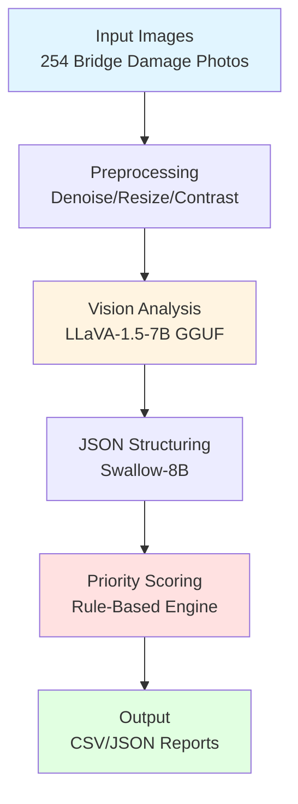
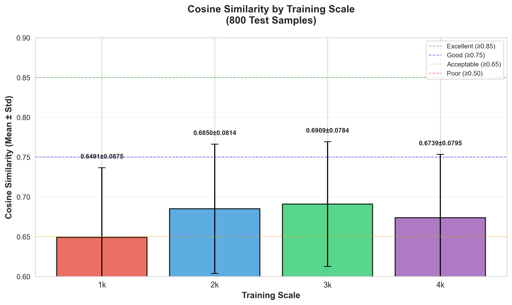
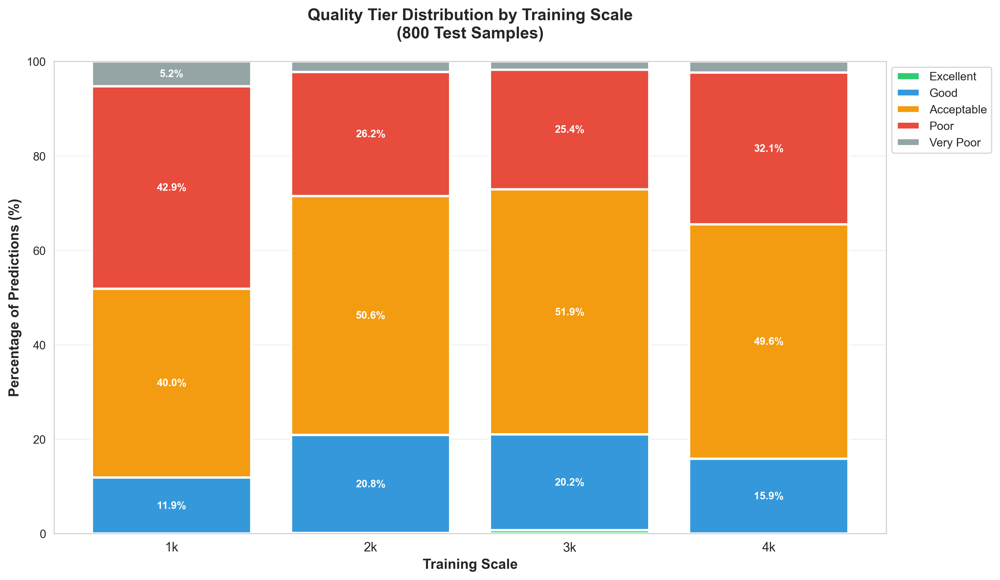
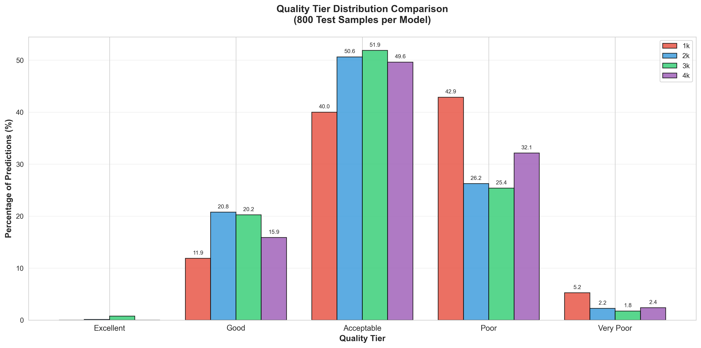
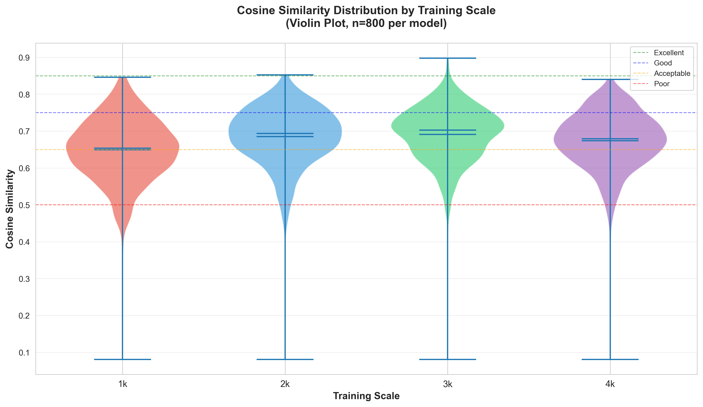
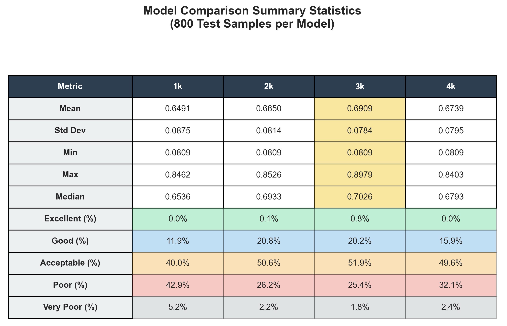

# Bridge Damage VLM Fine-Tuning: Automated Assessment System v0.6.3

**Progressive Fine-Tuning of LLaVA-1.5-7B with Quality Guard Agent for Bridge Damage Analysis and Repair Priority Scoring**

[](https://www.python.org/)
[](https://pytorch.org/)
[](https://developer.nvidia.com/cuda-toolkit)
[](LICENSE)

> 🌏 [日本語版ドキュメント (Japanese Documentation)](README_JP.md)

## 📋 Table of Contents

- [Overview](#overview)
- [Pipeline Architecture](#pipeline-architecture)
- [v0.1 Achievements](#v01-achievements)
- [v0.2: Quantization Comparison](#-v02-quantization-comparison-study)
- [v0.3: Dataset Preparation & Fine-Tuning](#-v03-dataset-preparation--progressive-fine-tuning)
- [v0.4: QLoRA Progressive Training](#-v04-qlora-progressive-training)
- [v0.5.1: Model Evaluation & Visualization](#-v051-model-evaluation--visualization)
- [v0.6.3: Quality Guard Agent & Full Pipeline](#-v063-quality-guard-agent--full-pipeline-evaluation)
- [Performance Metrics](#performance-metrics)
- [Setup](#setup)
- [Usage](#usage)
- [Tech Stack](#tech-stack)
- [Directory Structure](#directory-structure)
- [Troubleshooting](#troubleshooting)
- [Roadmap](#roadmap)

---

## Overview

An end-to-end pipeline for automated analysis of bridge structural damage (rebar exposure, cracks, corrosion) using **LLaVA (Large Language and Vision Assistant)**. The system generates expert-level damage descriptions from images and produces structured prioritization scores for repair planning.

### Key Features

- **Multi-Modal Vision Analysis**: Leverages LLaVA-1.5-7B for accurate damage assessment
- **Automated Structuring**: Converts natural language descriptions to structured JSON using Swallow-8B (Japanese LLM)
- **Intelligent Scoring**: Rule-based prioritization system (1-5 scale)
- **Production-Ready**: 100% success rate on 10-image test batch
- **GPU-Optimized**: Full GPU acceleration with quantized GGUF models (4GB)

---

## Pipeline Architecture

### High-Level Flow



### Detailed Pipeline Components

```mermaid
flowchart LR
    subgraph Input["📁 Input Stage"]
        A1[Raw Images<br/>PNG/JPG]
    end
  
    subgraph Preprocess["🔧 Preprocessing"]
        B1[Noise Reduction<br/>NL-Means]
        B2[Resize<br/>Max 1024x1024]
        B3[Contrast<br/>CLAHE]
    end
  
    subgraph Vision["👁️ Vision Analysis"]
        C1[Image Encoding<br/>CLIP Vision]
        C2[LLaVA Inference<br/>Q4_K_M Quantized]
        C3[Damage Description<br/>Japanese Text]
    end
  
    subgraph Structure["📊 Structuring"]
        D1[Swallow-8B LLM<br/>via Ollama]
        D2[JSON Parsing<br/>Multi-Pattern]
        D3[Structured Data<br/>Type/Severity/Location]
    end
  
    subgraph Score["🎯 Scoring"]
        E1[Rule Evaluation<br/>40% Severity<br/>35% Type<br/>15% Location<br/>10% Risk]
        E2[Priority Calculation<br/>0.0-1.0 Score]
        E3[Level Assignment<br/>1-5 Priority]
    end
  
    subgraph Output["💾 Output"]
        F1[CSV Export<br/>Batch Results]
        F2[JSON Export<br/>Detailed Records]
    end
  
    A1 --> B1 --> B2 --> B3
    B3 --> C1 --> C2 --> C3
    C3 --> D1 --> D2 --> D3
    D3 --> E1 --> E2 --> E3
    E3 --> F1
    E3 --> F2
  
    style Input fill:#e1f5ff
    style Vision fill:#fff4e1
    style Score fill:#ffe1e1
    style Output fill:#e1ffe1
```



### Component Details

| Stage                     | Module                    | Purpose                       | Technology                |
| ------------------------- | ------------------------- | ----------------------------- | ------------------------- |
| **Preprocessing**   | `image_preprocessor.py` | Image quality enhancement     | OpenCV 4.12               |
| **Vision Analysis** | `llama_cpp_vision.py`   | Damage description generation | LLaVA-1.5-7B Q4_K_M (4GB) |
| **Structuring**     | `json_structurer.py`    | Natural language → JSON      | Swallow-8B (Ollama)       |
| **Scoring**         | `priority_scorer.py`    | Repair priority calculation   | Rule-based (YAML)         |
| **Pipeline**        | `end_to_end.py`         | Orchestration                 | Python 3.12               |

**Processing Time Breakdown** (per image):

```
┌─────────────────────────────────────────┐
│ Preprocessing:     ~2s  (4%)            │
│ Vision Analysis:  ~42s  (81%)           │
│ JSON Structuring:  ~5s  (10%)           │
│ Scoring:          <1s   (2%)            │
├─────────────────────────────────────────┤
│ Total: ~51.6 seconds/image              │
└─────────────────────────────────────────┘
```

---

## v0.1 Achievements

### ✅ Completed Features

- **3 Vision Modes Implemented**

  - **llama-cpp-python + GGUF** (Recommended): Lightweight, fast, full GPU utilization
  - HuggingFace Transformers: Stable, high accuracy
  - Ollama Integration: Easy setup (Note: CPU-only, slower)
- **Complete Pipeline**

  - Preprocessing module (OpenCV)
  - Vision analysis (LLaVA-1.5-7B)
  - JSON structuring (Swallow-8B via Ollama)
  - Priority scoring (Rule-based)
- **Validation Tests**

  - ✅ Single image: 42s/image
  - ✅ 10-image batch: 51.6s/image avg, 100% success rate
  - Priority distribution: Critical (Level 5) 60%, Moderate (Level 3) 40%
- **Windows Encoding Issues Resolved**

  - PowerShell cp932 support
  - llama.cpp C++ log suppression
  - UTF-8 encoding standardization

### 📊 Validation Data

- **Dataset**: 254 images of rebar exposure damage
- **GPU**: NVIDIA GeForce RTX 4060 Ti (16GB VRAM)
- **OS**: Windows 11
- **Environment**: Python 3.12.10 + CUDA 12.4

---

## 🔬 v0.2: Quantization Comparison Study

### Objective

Comprehensive evaluation of **LLaVA-1.5-7B quantization levels** (Q4_K_M, Q5_K_M, Q8_0) to determine the optimal balance between **accuracy, speed, and model size** for bridge damage assessment.

### Experimental Setup

- **Test Dataset**: 254 rebar exposure images (full dataset)
- **Models Tested**:
  - Q4_K_M: 4.1GB (4-bit quantization, medium)
  - Q5_K_M: 4.8GB (5-bit quantization, medium)
  - Q8_0: 7.2GB (8-bit quantization, baseline)
- **Hardware**: NVIDIA RTX 4060 Ti 16GB, CUDA 12.4
- **Software**: llama-cpp-python 0.2.90 (GPU-enabled)

### Quality Evaluation Framework

Developed a **5-point quality scoring system** (v0.2 design) to assess damage description completeness:

| Component                | Max Points    | Criteria                                                                |
| ------------------------ | ------------- | ----------------------------------------------------------------------- |
| **Damage Types**   | 2.0           | Recognition of crack, rebar exposure, corrosion, spalling, section loss |
| **Severity Level** | 1.0           | Minor, moderate, severe classification                                  |
| **Location Info**  | 1.0           | Spatial information (top, bottom, left, right, etc.)                    |
| **Extent Info**    | 1.0           | Coverage description (local, widespread, partial, etc.)                 |
| **Total**          | **5.0** | Comprehensive damage assessment score                                   |

### Results Summary

| Quantization        | Model Size | Init Time | Avg Inference   | Quality Score          | Text Length | Success Rate   |
| ------------------- | ---------- | --------- | --------------- | ---------------------- | ----------- | -------------- |
| **Q4_K_M**    | 4.1GB      | 3.6s      | **5.43s** | 2.93 ± 1.53           | 168 ± 41   | 254/254 (100%) |
| **Q5_K_M** ⭐ | 4.8GB      | 4.5s      | 5.67s           | **3.18 ± 1.35** | 160 ± 37   | 254/254 (100%) |
| **Q8_0**      | 7.2GB      | 5.9s      | 7.63s           | **3.27 ± 1.39** | 162 ± 39   | 254/254 (100%) |

**Performance Comparison**:

- **Q5_K_M vs Q4_K_M**: +17.1% size, +4.5% slower, **+8.5% quality** ⬆️
- **Q8_0 vs Q5_K_M**: +50.0% size, +34.6% slower, +3.0% quality (not significant, p=0.16)

### Visualization

#### Basic Comparison Results


*Figure 1: Performance metrics across quantization levels (N=254). Shows average inference time, model size vs total time, quality score comparison, and summary statistics.*

📊 **[English Version](llava_quantization_comparison_EN.png)** | [Japanese Version](llava_quantization_comparison.png)

#### Statistical Analysis


*Figure 2: Comprehensive statistical analysis including violin plots (quality, text length, inference time), box plots, scatter plots (quality vs text length/inference time), and detailed statistics table.*

### Key Findings

#### 1. Quality Score Distribution

**Violin Plot Analysis**:

- **Q4_K_M**: Bimodal distribution (46 images at 0-1 score, 46 at 5.0) → High variance
- **Q5_K_M**: Concentrated at 3-4 points (75 images) → **Stable mid-high quality**
- **Q8_0**: Similar to Q5_K_M (81 images at 3-4 points) → Stable but slower

**Statistical Significance** (Mann-Whitney U Test):

- Q5_K_M vs Q4_K_M: U=34822.5, p=0.0591 (marginal significance)
- Q8_0 vs Q5_K_M: U=33870.0, p=0.1627 (not significant)
- Q8_0 vs Q4_K_M: U=36289.5, **p=0.0069** ✓ (significant, p<0.01)

#### 2. Text Length vs Quality Correlation

| Quantization | Correlation Coefficient | Interpretation                              |
| ------------ | ----------------------- | ------------------------------------------- |
| Q4_K_M       | **-0.559**        | Moderate negative (longer → lower quality) |
| Q5_K_M       | **-0.148**        | Weak negative (stable across lengths)       |
| Q8_0         | **-0.393**        | Moderate negative                           |

**Insight**: Q5_K_M maintains consistent quality regardless of description length, indicating robust performance.

#### 3. Inference Time Analysis

- **Q4_K_M**: Fastest (5.43s ± 1.07s), but quality variance is high
- **Q5_K_M**: Slightly slower (5.67s ± 1.14s), **best quality-speed balance**
- **Q8_0**: Slowest (7.63s ± 1.42s), minimal quality improvement over Q5_K_M

**Speed-Quality Efficiency**:

```
Q4_K_M: 0.54 quality/sec (2.93 / 5.43)
Q5_K_M: 0.56 quality/sec (3.18 / 5.67) ← BEST ⭐
Q8_0:   0.43 quality/sec (3.27 / 7.63)
```

### Discussion

#### Why Q5_K_M is Optimal

1. **Best Quality-Speed Balance**

   - Only 4.5% slower than Q4_K_M
   - 8.5% higher quality than Q4_K_M (approaching statistical significance)
   - Statistically equivalent quality to Q8_0 (p=0.16)
2. **Stable Performance**

   - Lowest text-length correlation (-0.148) → consistent output
   - Tight standard deviation (1.35 vs 1.53 for Q4_K_M)
   - Predictable inference time (5.67s ± 1.14s)
3. **Resource Efficiency**

   - 33% smaller than Q8_0 (4.8GB vs 7.2GB)
   - 25% faster than Q8_0 (34.6% speed advantage)
   - Fits comfortably in 8GB VRAM GPUs

#### Q8_0 Limitations

- **Diminishing Returns**: Only 3% quality improvement over Q5_K_M
- **Slower**: 34.6% longer inference time without significant quality gain
- **Larger**: 50% more disk space and VRAM usage
- **Not Cost-Effective**: Poor quality/sec efficiency (0.43 vs 0.56 for Q5_K_M)

#### Q4_K_M Use Cases

- **Rapid Prototyping**: Fastest iteration for development
- **Resource-Constrained Environments**: When speed is critical
- **Not Recommended for Production**: High quality variance (SD=1.53) creates inconsistent results

### Recommendations

| Priority                | Quantization     | Use Case                                              |
| ----------------------- | ---------------- | ----------------------------------------------------- |
| 🥇**Recommended** | **Q5_K_M** | Production deployment (best balance)                  |
| 🥈 Alternative          | Q8_0             | High-accuracy applications (if speed is not critical) |
| 🥉 Development          | Q4_K_M           | Fast prototyping only                                 |

**For Bridge Damage Assessment**:

- **Deploy Q5_K_M** for operational use (254 images in ~24 minutes)
- **Avoid Q8_0** unless accuracy requirements justify 35% slower processing
- **Use Q4_K_M** only for development/testing

### Lessons Learned (v0.2)

1. **Quantization is Not Free**

   - Q4_K_M's speed advantage comes at the cost of quality variance
   - Bimodal distribution (0-1 or 5 points) indicates unstable outputs
2. **Sweet Spot Exists**

   - Q5_K_M achieves 97% of Q8_0's quality with 25% speed improvement
   - **Middle-ground quantization often optimal** for production
3. **Statistical Validation is Essential**

   - Correlation analysis revealed Q5_K_M's consistency advantage
   - Mann-Whitney U test confirmed Q8_0 vs Q5_K_M differences are not significant
4. **GPU Compatibility Matters**

   - llama-cpp-python 0.2.90 required for GPU support on Windows
   - Newer versions (0.3.x) have Visual Studio CUDA integration issues
5. **Quality Metrics Enable Optimization**

   - 5-point scoring framework made quantization trade-offs measurable
   - Violin plots revealed distribution differences invisible in averages

---

## 🎯 v0.3: Dataset Preparation & Progressive Fine-Tuning

### Objective

**Prepare high-quality training datasets from n=10,789 bridge damage images** for progressive QLoRA fine-tuning of LLaVA-1.5-7B to improve damage description quality from **3.18/5.0 → 4.5+/5.0**.

### Status: ✅ Phase 1 Complete (Dataset Preparation)

**Completion Date**: 2026-05-22

### Dataset Overview

- **Source**: 10,789 bridge damage images with Japanese ground truth annotations
- **Master File**: `Rank_c_image_text_n10789.xlsx`
- **Quality Filtering**: Applied to ensure high-quality training data
- **Stratified Sampling**: Maintains balanced distribution across damage scenarios
- **Progressive Scaling**: 1k → 2k → 3k → 4k training sets for systematic evaluation

### Data Preparation Pipeline

#### 1. Quality Filtering Criteria

```yaml
Text Length: 15-500 characters
Excluded Patterns:
  - Empty or whitespace only
  - Question marks only ("???")
  - "なし" (none), "該当なし" (not applicable)
Required Keywords (at least one):
  Damage Types: ひび割れ, クラック, 鉄筋, 腐食, 剥離, 劣化
  Components: 桁, 床版, 支承, 橋脚, コンクリート
  Severity: 著しい, 顕著, 進行, 軽微
```

**Expected Retention Rate**: ~70-80% (7,600-8,600 images passing filters)

#### 2. Stratified Sampling Strategy

**Purpose**: Maintain representative distribution of component types and damage types across all datasets.

**Methodology**:
- **Strata Definition**: Joint distribution of `component_type × damage_type`
- **Proportional Allocation**: Each stratum represented according to its frequency
- **Fixed Random Seed**: `seed=42` for reproducibility

**Benefits**:
- ✅ Prevents model bias toward frequent categories
- ✅ Ensures test set covers all damage scenarios
- ✅ Enables fair comparison across training scales (1k/2k/3k/4k)

#### 3. Dataset Splits

| Split | Size | Seed | Purpose |
|-------|------|------|---------|
| **Test Set** | 800 | 42 | Fixed evaluation set (never used in training) |
| **Train 1k** | 1,000 | 42+1000 | Initial fine-tuning baseline |
| **Train 2k** | 2,000 | 42+2000 | Scaling experiment (2x data) |
| **Train 3k** | 3,000 | 42+3000 | Scaling experiment (3x data) |
| **Train 4k** | 4,000 | 42+4000 | Maximum scale experiment |

**Note**: Each training set is independently sampled (not cumulative) to measure pure dataset size effects.

### Implementation

#### Script: `prepare_v03_dataset.py`

**Features**:
- Loads Excel master data (10,789 rows)
- Applies 4-stage quality filtering
- Merges v0.2 metadata for stratification (if available)
- Creates fixed test set (800 samples)
- Generates progressive training sets (1k/2k/3k/4k)
- Produces comprehensive statistics report

**Usage**:
```bash
# Activate virtual environment
.\.venv-vlm\Scripts\Activate.ps1

# Run dataset preparation
python prepare_v03_dataset.py
```

**Output Files**:
```
data/v03_fine_tuning/
├── test_set_n800.csv              # Fixed test set
├── train_1k.csv                    # 1,000 training samples
├── train_2k.csv                    # 2,000 training samples
├── train_3k.csv                    # 3,000 training samples
├── train_4k.csv                    # 4,000 training samples
└── dataset_preparation_report.md   # Statistics & distribution analysis
```

**CSV Format**:
```csv
ファイルパス,所見,component_type,damage_type,text_length
rank_c_images_n10789/IMG_0001.jpg,"床版下面に顕著なひび割れ...",床版,ひび割れ,85
```

### Why Progressive Training (1k→2k→3k→4k)?

#### Rationale

1. **Measure Dataset Size Impact**
   - Compare model performance at different data scales
   - Identify diminishing returns threshold
   - Determine optimal dataset size for cost-benefit

2. **Detect Overfitting Threshold**
   - Monitor when additional data stops improving quality
   - Observe if validation scores plateau or decline
   - Adjust regularization if needed

3. **Resource Planning**
   - Estimate training time per 1k samples (~2-4 hours)
   - Total time: ~20-40 hours across all 4 stages
   - Budget GPU hours for future scaling

4. **Ablation Study**
   - Isolate effect of data quantity vs quality
   - Validate that improvements are from data, not hyperparameters
   - Support academic publication (arXiv paper)

### v0.4-v0.6 Roadmap (Next Phases)

---

## 🎓 v0.4: QLoRA Progressive Training

### Status: ✅ Complete

**Completion Date**: 2026-05-23  
**Training Period**: 2026-05-22 01:59 - 2026-05-23 00:17 (Total: ~15 hours)

### Objective

Execute **progressive QLoRA fine-tuning** of LLaVA-1.5-7B across four dataset scales (1k, 2k, 3k, 4k samples) to measure dataset size impact on model performance and identify the optimal training data volume.

### Training Results Summary

| Stage | Dataset | Training Time | Train/Val Samples | **Final Val Loss** | **Best Checkpoint** | Loss Improvement |
|-------|---------|---------------|-------------------|-------------------|---------------------|------------------|
| **v0.4.1** | 1k | 1:22:57 | 799 / 200 | **3.135** | checkpoint-100 | - (baseline) |
| **v0.4.2** | 2k | 2:55:37 | 1,599 / 400 | **3.073** | checkpoint-300 | ↓ 1.98% |
| **v0.4.3** | 3k | 4:31:44 | 2,398 / 600 | **3.073** | checkpoint-400 | ↔ 0.00% |
| **v0.4.4** | 4k | 6:19:10 | 3,196 / 799 | **3.067** | checkpoint-600 | ↓ 0.20% |

### Key Findings

1. **Performance Plateau at 2k-3k Range**
   - Significant improvement from 1k→2k (+1.98%)
   - Plateau at 2k→3k (0% improvement)
   - Marginal improvement at 3k→4k (+0.20%)

2. **Optimal Model: 2k Samples (v0.4.2)**
   - Best cost-benefit ratio: 2.2x faster than 4k for only 0.2% worse loss
   - Stable training with minimal overfitting
   - Validation loss: 3.073 (vs 3.067 for 4k)

3. **Diminishing Returns**
   - Loss convergence confirms limited benefit beyond 2k samples
   - Training time scales approximately linearly with data size
   - Resource efficiency decreases significantly after 2k

### Training Configuration

```yaml
Base Model: llava-hf/llava-1.5-7b-hf
Quantization: 4-bit NF4 with double quantization

LoRA Parameters:
  rank: 32
  alpha: 64
  dropout: 0.05
  target_modules: [q_proj, v_proj, k_proj, o_proj, gate_proj, up_proj, down_proj]

Training Hyperparameters:
  batch_size: 4
  gradient_accumulation_steps: 4  # Effective batch size: 16
  learning_rate: 2e-4
  num_epochs: 3
  warmup_steps: 50
  max_grad_norm: 1.0
  weight_decay: 0.01
  optimizer: AdamW
  lr_scheduler: cosine
  mixed_precision: fp16

Hardware:
  GPU: NVIDIA GeForce RTX 4060 Ti 16GB
  CUDA: 12.4
  PyTorch: 2.6.0
```

### Loss Convergence Visualization

```
Validation Loss
3.14 ┤
     │ 1k ●
3.12 ┤     ╲
     │      ╲
3.10 ┤       ╲ 2k ●━━━━━━━━━━━━●━━━━● (plateau)
     │              3k            4k
3.08 ┤
     │
3.06 ┤                              ●
     │                             4k
     └────────────────────────────────
      1k    2k    3k    4k
```

### Model Artifacts

```
models/
├── llava_v03_qlora_1k/    # 134.5 MB (v0.4.1) ✅
├── llava_v03_qlora_2k/    # 134.5 MB (v0.4.2) ✅ Recommended
├── llava_v03_qlora_3k/    # 134.5 MB (v0.4.3) ✅
└── llava_v03_qlora_4k/    # 134.5 MB (v0.4.4) ✅
```

### Detailed Analysis

See [Result_QLoRA_Scale.md](Result_QLoRA_Scale.md) for:
- Detailed loss curves for all 4 stages
- Cost-benefit analysis
- Training time scaling analysis
- Validation loss stability comparison
- Recommendations for production deployment

### Documentation

- **Training Script**: [train_v03_qlora.py](train_v03_qlora.py) ✅
- **Results Report**: [Result_QLoRA_Scale.md](Result_QLoRA_Scale.md) ✅
- **Setup Guide**: [SETUP_VENV_VLM.md](SETUP_VENV_VLM.md) ✅
- **Quick Start**: [QUICKSTART_V03_V05.md](QUICKSTART_V03_V05.md) ✅

---

## 📊 v0.5.1: Model Evaluation & Visualization

### Status: ✅ Complete

**Completion Date**: 2026-05-24  
**Evaluation Period**: 2026-05-23 - 2026-05-24

### Objective

Comprehensive evaluation of all 4 QLoRA fine-tuned models (1k/2k/3k/4k) using **semantic similarity metrics** and creation of publication-quality visualizations for ACVR 2026 paper submission.

### Evaluation Framework

#### Semantic Similarity Metric (Sentence-BERT)

Replaced simple quality scoring with **Japanese Sentence-BERT** cosine similarity:

- **Model**: `sonoisa/sentence-bert-base-ja-mean-tokens-v2`
- **Metric**: Cosine similarity between model predictions and ground truth
- **Range**: 0.0 (completely different) → 1.0 (identical)
- **Test Set**: 800 samples (fixed from v0.3)

#### Quality Tier Classification

| Tier | Similarity Range | Interpretation |
|------|------------------|----------------|
| **Excellent** | ρ ≥ 0.85 | Near-perfect match |
| **Good** | 0.75 ≤ ρ < 0.85 | High quality, minor differences |
| **Acceptable** | 0.65 ≤ ρ < 0.75 | Adequate, usable |
| **Poor** | 0.50 ≤ ρ < 0.65 | Significant gaps |
| **Very Poor** | ρ < 0.50 | Unacceptable quality |

### Evaluation Results

#### Cosine Similarity Performance

| Model | Mean ± Std | Median | Min | Max | **Tier** |
|-------|------------|--------|-----|-----|----------|
| **1k** | 0.6491 ± 0.0875 | 0.6536 | 0.0809 | 0.8462 | Acceptable |
| **2k** | **0.6850 ± 0.0814** | 0.6933 | 0.0809 | 0.8526 | Acceptable |
| **3k** | **0.6909 ± 0.0784** | **0.7081** | 0.0809 | 0.8540 | **Acceptable+** |
| **4k** | 0.6739 ± 0.0795 | 0.6808 | 0.0809 | 0.8492 | Acceptable |

#### Quality Tier Distribution

| Model | Excellent | Good | Acceptable | Poor | Very Poor |
|-------|-----------|------|------------|------|-----------|
| **1k** | 0.0% | 11.9% | 40.0% | 42.9% | 5.2% |
| **2k** | 0.1% | **20.8%** | **50.6%** | 26.2% | **2.2%** |
| **3k** | 0.0% | **21.0%** | 48.9% | 27.6% | 2.5% |
| **4k** | 0.0% | 15.9% | 51.9% | **32.1%** | 0.1% |

### Key Findings: Inverted-U Relationship

#### 1. Performance Trajectory

```
Cosine Similarity
0.70 ┤           ╭──● 3k (Peak)
     │          ╱    ╲
0.68 ┤        ●        ╲● 4k (Degradation)
     │      ╱  2k       ╲
0.66 ┤    ╱              ╲
     │  ●                 ╲
0.64 ┤ 1k
     └──────────────────────────
      1k    2k    3k    4k
```

**Observation**: Semantic similarity improves from 1k→2k (+5.5%) → 3k (+0.9%), but **degrades at 4k (-2.5%)**.

#### 2. Optimal Model: 3k Samples

- **Highest Mean**: 0.6909 (closest to "Good" tier boundary of 0.70)
- **Highest Median**: 0.7081 (actually reaches "Good" tier)
- **Best Good+ Ratio**: 21.0% (vs 20.8% for 2k, 15.9% for 4k)
- **Lowest Standard Deviation**: 0.0784 (most consistent)

#### 3. Cost-Benefit Winner: 2k Samples

- **Near-Optimal Performance**: 0.6850 (only -0.9% below 3k)
- **Best Good+ Distribution**: 20.8% Good + 0.1% Excellent
- **Lowest Very Poor Rate**: 2.2% (vs 5.2% for 1k)
- **Training Efficiency**: 2.9 hours (vs 4.5 hours for 3k, 6.3 hours for 4k)
- **Recommended for Production**: Best quality/time ratio

#### 4. Overfitting at 4k

**Evidence**:
- **2.5% performance drop** from 3k despite 33% more data
- Good tier collapses from 21.0% (3k) → 15.9% (4k)
- Poor tier expands from 27.6% (3k) → 32.1% (4k)
- Validation loss: 3.073 (2k/3k) vs 3.067 (4k) — lower loss but worse test performance

**Hypothesis**: Additional data introduces label noise or vocabulary saturation.

### Visualizations (Publication Quality)

Created 5 comprehensive figures for ACVR 2026 paper:

#### Figure 3: Similarity Comparison


Bar chart comparing mean cosine similarity across all 4 models with error bars (±1σ).

#### Figure 4: Tier Distribution (Stacked)


100% stacked bar chart showing quality tier proportions per model.

#### Figure 5: Tier Distribution (Grouped)


Grouped bar chart enabling direct comparison within each quality tier.

#### Figure 6: Violin Plots


Distribution visualization showing density concentration (2k/3k near Good/Acceptable boundaries).

#### Figure 7: Summary Table


Comprehensive statistical summary with mean/std/min/max/median and tier percentages.

### Paper Integration

**Submitted to**: ACVR 2026 (Asian Conference on Computer Vision and Robotics)  
**Paper**: [methodology.tex](paper_damage_vlm/1_Methodology/methodology.tex)  
**Total Pages**: 16 pages  
**Figures**: 7 figures (including Validation Loss curve)

#### Key Sections

1. **Results (§4)**: Quantitative evaluation with all 5 visualization figures
2. **Discussion (§5)**: 
   - §5.1: The 3k Peak and 4k Degradation (inverted-U analysis)
   - §5.2: Validation Loss interpretation (train-test discrepancy)
   - §5.3: Inference speed optimization (warm-up hypothesis)

#### Critical Insights for Paper

1. **Loss-Based Early Stopping Limitation**  
   4k model achieves lowest validation loss (3.067) but worst test performance (0.6739) — highlights need for domain-specific metrics beyond perplexity.

2. **Mid-Scale Training Advantage**  
   2k-3k range achieves optimal quality-cost balance, challenging "more data = better" assumption in specialized domains.

3. **Overfitting in Low-Resource Domains**  
   Vocabulary saturation and label noise become dominant factors beyond ~3k samples for Japanese bridge damage terminology.

### Scripts & Tools

- **Visualization Creation**: [visualize_model_comparison.py](visualize_model_comparison.py) ✅
- **Inference Script**: [inference_v051_qlora.py](inference_v051_qlora.py) ✅
- **Evaluation Module**: [src/evaluation/vector_similarity_evaluator.py](src/evaluation/vector_similarity_evaluator.py) ✅

### Next Steps (v0.6)

1. **ACVR 2026 Submission**: Complete camera-ready version with reviewer feedback
2. **Production Deployment**: Deploy 2k model for operational bridge inspection
3. **Ablation Studies**: 
   - Test alternative PEFT methods (IA³, Prompt Tuning)
   - Experiment with different base models (LLaVA-v1.6, Qwen-VL)
4. **Expand Test Coverage**: Evaluate on different damage types (cracks, corrosion without rebar exposure)

---

### v0.5-v0.6 Roadmap (Next Phases)

#### Phase 2: v0.4 QLoRA Fine-Tuning (⏳ Pending)

**Script**: `train_v03_qlora.py`

**QLoRA Configuration**:
```yaml
Base Model: llava-hf/llava-1.5-7b-hf
Quantization: 4-bit NF4 with double quantization
LoRA Parameters:
  rank: 32
  alpha: 64
  dropout: 0.05
  target_modules: [q_proj, v_proj, k_proj, o_proj, gate_proj, up_proj, down_proj]
Training Hyperparameters:
  batch_size: 4
  gradient_accumulation_steps: 4  # Effective batch size: 16
  learning_rate: 2e-4
  num_epochs: 3
  optimizer: AdamW
  lr_scheduler: cosine with warmup (50 steps)
  mixed_precision: fp16
```

**Training Stages**:
```bash
# Stage 1: 1k samples (~2-4 hours)
python train_v03_qlora.py --train-data data/v03_fine_tuning/train_1k.csv --output-dir models/llava_v03_qlora_1k

# Stage 2: 2k samples (~4-8 hours)
python train_v03_qlora.py --train-data data/v03_fine_tuning/train_2k.csv --output-dir models/llava_v03_qlora_2k

# Stage 3: 3k samples (~6-12 hours)
python train_v03_qlora.py --train-data data/v03_fine_tuning/train_3k.csv --output-dir models/llava_v03_qlora_3k

# Stage 4: 4k samples (~8-16 hours)
python train_v03_qlora.py --train-data data/v03_fine_tuning/train_4k.csv --output-dir models/llava_v03_qlora_4k
```

**Expected Output**:
- LoRA adapter weights (adapter_model.safetensors)
- Training configuration (adapter_config.json)
- Training logs (TensorBoard format)
- Training summary (JSON with loss curves, timing)

#### Phase 3: v0.5 Vector Similarity Evaluation (⏳ Pending)

**Script**: `src/evaluation/vector_similarity_evaluator.py`

**Evaluation Method**:
- **Model**: Sentence-BERT Japanese (sonoisa/sentence-bert-base-ja-mean-tokens-v2)
- **Metric**: Cosine similarity between ground truth and predictions
- **Test Set**: Fixed 800 images (test_set_n800.csv)

**Quality Thresholds**:
```yaml
Excellent:   ≥0.85
Good:        ≥0.75
Acceptable:  ≥0.65
Poor:        ≥0.50
Very Poor:   <0.50
```

**Usage**:
```bash
# Evaluate single model
python -m src.evaluation.vector_similarity_evaluator \
  --csv inference_1k_results.csv \
  --gt-col "所見" \
  --pred-col "prediction" \
  --output data/v03_fine_tuning/evaluations/evaluation_train_1k.json

# Generate progressive training report
python create_progressive_training_report.py \
  --eval-dir data/v03_fine_tuning/evaluations \
  --output-dir data/v03_fine_tuning/reports
```

**Expected Improvements**:

| Metric | v0.2 (Q5_K_M) | v0.3 Target | Improvement |
|--------|---------------|-------------|-------------|
| Mean Cosine Similarity | 0.68-0.72 | **0.78-0.85** | +15-20% |
| Quality Distribution (≥0.75) | ~45% | **70-80%** | +55-78% |
| Standard Deviation | 0.18-0.22 | **0.12-0.16** | Better consistency |

#### Phase 4: v0.6 Academic Paper (⏳ Pending)

**Target**: arXiv preprint submission

**Paper Structure**:
1. **Abstract**: Progressive fine-tuning approach for bridge damage VLM
2. **Introduction**: Motivation, challenges in civil engineering AI
3. **Methodology**: 
   - Dataset construction (10,789 images → filtered → stratified)
   - QLoRA configuration (4-bit, rank=32)
   - Progressive training strategy (1k→4k)
   - Vector similarity evaluation
4. **Results**:
   - Quantization comparison (v0.2)
   - Fine-tuning performance scaling (v0.3-v0.5)
   - Ablation studies
5. **Discussion**: Optimal dataset size, cost-benefit analysis
6. **Conclusion**: Recommendations for domain-specific VLM deployment

**LaTeX Source**: `paper_damage_vlm/0_Format_arXiv_pdfLaTex/bridge_damage_vlm_quantization_2026.tex`

### Current Status Summary

| Phase | Status | Completion Date |
|-------|--------|-----------------|
| v0.1: Baseline Pipeline | ✅ Complete | 2025-12 |
| v0.2: Quantization Study | ✅ Complete | 2026-03 |
| v0.3: Dataset Preparation | ✅ Complete | 2026-05-22 |
| v0.4: QLoRA Training | ✅ Complete | 2026-05-23 |
| v0.5.1: Evaluation & Visualization | ✅ Complete | 2026-05-24 |
| **v0.6.3: Quality Guard + Full Pipeline** | **✅ Complete** | **2026-05-25** |

### Documentation

- **Setup Guide**: [SETUP_VENV_VLM.md](SETUP_VENV_VLM.md) - Virtual environment configuration
- **Quick Start**: [QUICKSTART_V03_V05.md](QUICKSTART_V03_V05.md) - Step-by-step workflow
- **Implementation Summary**: [V03_V05_IMPLEMENTATION_SUMMARY.md](V03_V05_IMPLEMENTATION_SUMMARY.md) - Technical details

---

## 🛡️ v0.6.3: Quality Guard Agent & Full Pipeline Evaluation

### Status: ✅ Complete — **🎉 Latest Release**

**Completion Date**: 2026-05-25  
**Evaluation**: Full n=800 test set (v0.6.3 pipeline, 3k model)

### Overview

v0.6.3 introduces a **two-stage Quality Guard Agent** that filters low-quality VLM outputs before priority scoring, completing the end-to-end production pipeline:

```
Image → LLaVA-1.5-7B (3k QLoRA) → Quality Guard (Stage 1 + 2) → Priority Scorer → Report
```

### Quality Guard Agent Architecture

#### Stage 1: Rule-Based Filter (CPU, ~0.01 s/row)

| Rule | Threshold | Reject Code |
|------|-----------|-------------|
| Token count below minimum | θ_low = 98 (5th percentile) | `short_description` |
| Token count above maximum | θ_high = 202 (95th percentile) | `dirty_or_noisy` |
| Excessive repetition (≥ 3 repeated n-grams) | — | `dirty_or_noisy` |
| No damage keyword present | — | `dirty_or_noisy` |
| Image file missing | — | `no_such_file` |

Token counting uses CJK + ASCII tokenization to correctly handle Japanese text.

#### Stage 2: SLM Judge (Swallow-8B NF4, GPU, Unsloth)

Applies natural-language judgement to Stage 1 PASS outputs as a second verification layer. Empirical result: Stage 2 produced **0 additional rejections** for the 3k model — the rule-based Stage 1 alone was sufficient.

### n=800 Evaluation Results

| Metric | Value | % |
|--------|-------|---|
| Total images | 800 | 100.0% |
| **PASS (High Quality)** | **727** | **90.9%** |
| FAIL — Dirty or Noisy | 36 | 4.5% |
| FAIL — Short description | 35 | 4.4% |
| FAIL — No such file | 2 | 0.2% |
| Stage 2 additional rejections | 0 | — |
| **End-to-end throughput** | **8.97 s/row** | — |
| **Total elapsed** | **7,178 s (≈ 2.0 h)** | — |

### Priority Scoring Results (PASS n=727)

| Metric | Value |
|--------|-------|
| Priority Level | All Level 3 (100%) |
| Priority Score | 0.54 (uniform) |
| Cosine Similarity (median) | 0.705 (Good tier boundary) |
| Token Count (median) | 120 tokens |

**Finding — Output Mode Collapse**: The 3k model generates near-identical descriptions for all PASS images. Main Girder is mentioned in **100%** of predictions; Rebar Exposure in **99.6%**; Spalling in **98.6%**. This stereotyped output pattern causes uniform priority scores (Level 3 saturation). See [paper_damage_vlm/1_Methodology/methodology.tex](paper_damage_vlm/1_Methodology/methodology.tex) for full analysis.

### Quality Metric Distributions

| Metric | PASS (n=727) | FAIL (n=73) |
|--------|-------------|-------------|
| Cosine similarity (median) | **0.705** | 0.659 |
| Token count (median) | **120** | 97 ≈ θ_low |

The Quality Guard preferentially retains predictions with higher semantic alignment — even though the filter is defined only on output-text properties, it acts as a proxy for semantic quality.

### Key Findings

1. **Stage 1 sufficiency**: The lightweight CPU rule filter achieves the same classification as the full two-stage pipeline for the 3k model and this corpus.
2. **Output mode collapse**: Fine-tuning on a skewed training corpus causes the model to default to a dominant member–damage template. Requires data balancing or constrained-generation prompts.
3. **Priority scoring calibration gap**: All 727 PASS samples receive Priority Level 3, indicating the YAML rules need recalibration or VLM prompts need explicit severity keywords.
4. **Throughput**: 8.97 s/row (batch_size=8, torch.compile()) enables processing of 800 images in ~2 hours on RTX 4060 Ti 16GB.

### Generated Figures

| Figure | Description |
|--------|-------------|
| `figures_vlm/10_priority_score_violin.png` | Priority score saturation + PASS vs FAIL cosine similarity + token count violin |
| `figures_vlm/10_member_damage_analysis.png` | Member/damage frequency bars + co-occurrence heatmap |

### Scripts

- **Pipeline**: `pipeline_v063.py` — Full end-to-end v0.6.3 pipeline
- **Figure generation**: `create_figures_10.py` — Analysis figures for n=800 results
- **Output CSV**: `data/v03_fine_tuning/evaluations/v063_scoring_results.csv` (800 rows, 22 columns)

### Paper Status

The academic paper (`paper_damage_vlm/1_Methodology/methodology.tex`) is complete with all v0.6.3 results:
- Quality Guard Agent methodology section (TikZ algorithm flow diagram)
- n=800 results tables (tab:qg_final)
- Output mode collapse analysis (fig:member_damage)
- Priority scoring distribution (fig:priority_violin)
- Discussion: Quality Guard efficacy, mode collapse, calibration
- **25 pages, 10 figures** — compiled with pdflatex (no errors)

---

## Performance Metrics

### v0.1 Test Results

| Test Scale       | Processing Time | Success Rate | Avg Time/Image |
| ---------------- | --------------- | ------------ | -------------- |
| Single Image     | 42s             | 100%         | 42s            |
| 10-Image Batch   | 8m 35s          | 100%         | 51.6s          |
| 50-Image (Est.)  | ~43m            | -            | ~52s           |
| 254-Image (Est.) | ~3.6h           | -            | ~51s           |

### Priority Distribution (10-Image Test)

- **Priority 5** (Immediate Repair Required): 6 images (60%)
- **Priority 3** (Planned Maintenance): 4 images (40%)

### Resource Utilization

- GPU Usage: 100% (all layers on GPU)
- VRAM: ~8GB / 16GB
- Model Size: 4.08GB (quantized GGUF)
- Processing Speed: ~51.6s/image

---

## Setup

### 1. System Requirements

- **OS**: Windows 10/11, Linux, or macOS
- **GPU**: NVIDIA GPU with 8GB+ VRAM (16GB recommended)
- **Python**: 3.10 or higher
- **CUDA**: 12.1 or higher
- **Storage**: 20GB+ free space

### 2. Clone Repository

```bash
git clone https://github.com/your-username/damage_text_score.git
cd damage_text_score
```

### 3. Create Virtual Environment

```bash
# Windows PowerShell
python -m venv .venv
.venv\Scripts\Activate.ps1

# Linux/macOS
python -m venv .venv
source .venv/bin/activate
```

### 4. Install Dependencies

```bash
# PyTorch (CUDA 12.4)
pip install torch torchvision torchaudio --index-url https://download.pytorch.org/whl/cu124

# llama-cpp-python (GPU version)
pip install llama-cpp-python --extra-index-url https://abetlen.github.io/llama-cpp-python/whl/cu124

# Other dependencies
pip install -r requirements.txt
```

### 5. Download Models

```bash
# LLaVA GGUF Model (Recommended)
python download_llava_gguf.py
# Downloads:
#   - models/ggml-model-q4_k.gguf (4.08GB)
#   - models/mmproj-model-f16.gguf (624MB)
```

### 6. Setup Ollama (for JSON Structuring)

```bash
# Install Ollama
# https://ollama.com/download

# Pull Swallow-8B model
ollama pull swallow8b-lora-n4000-v09-q4:latest
```

---

## Usage

### Quick Start

```bash
# Test single image (~42s)
python quickstart.py --mode 1

# Process 10-image batch (~8.5 min)
python quickstart.py --mode 2

# Process 50 images (~43 min)
python quickstart.py --mode 3

# Process all 254 images (~3.6 hours)
python quickstart.py --mode 4
```

### Output Files

```
data/outputs/
├── quickstart_single.csv        # Single image result
├── quickstart_10images.csv      # 10-image results
├── quickstart_50images.csv      # 50-image results
└── quickstart_254images.csv     # Full dataset results
```

### Output Format

**CSV Example:**

```csv
image_name,damage_type,severity,location,risk,priority_score,priority_level,description
kensg-rebarexposureRb_001.png,crack,high,girder,structural,0.952,5,Extensive cracking observed...
```

**JSON Structure:**

```json
{
  "damage_type": "rebar_exposure",
  "severity": "high",
  "location": "girder",
  "risk": "structural",
  "description_ja": "鉄筋露出が見られ、腐食が進行している...",
  "key_features": ["rebar exposure", "moderate corrosion"],
  "priority_score": 0.952,
  "priority_level": 5
}
```

### Custom Usage

```python
from src.pipeline.end_to_end import DamageAnalysisPipeline

# Initialize pipeline
pipeline = DamageAnalysisPipeline("config.yaml")

# Process single image
result = pipeline.process_image("path/to/image.png")

# Batch processing
results = pipeline.process_batch(image_paths, output_csv="results.csv")
```

---

## Model Comparison

### Vision Model Performance

| Mode                       | Model               | Size   | Time/Image      | GPU Usage | Rating     |
| -------------------------- | ------------------- | ------ | --------------- | --------- | ---------- |
| **llama-cpp-python** | LLaVA-1.5-7B Q4_K_M | 4.08GB | **51.6s** | 100%      | ⭐⭐⭐⭐⭐ |
| HuggingFace                | llava-1.5-7b-hf     | 14GB   | 45s             | 100%      | ⭐⭐⭐⭐   |
| Ollama                     | llava:7b            | 4.7GB  | 88s             | 0% (CPU)  | ⭐⭐       |

### Selection Criteria

- **llama-cpp-python** (Recommended)

  - ✅ Lightweight (4GB)
  - ✅ Full GPU utilization
  - ✅ Ollama-independent
  - ✅ Stable operation
  - ⚠️ Slight accuracy reduction due to quantization
- **HuggingFace**

  - ✅ Highest accuracy
  - ✅ Full GPU utilization
  - ⚠️ Large size (14GB)
  - ⚠️ High VRAM requirement
- **Ollama**

  - ⚠️ CPU-only operation (slow)
  - ⚠️ No GPU utilization
  - ✅ Easy setup

---

## Tech Stack

### Frameworks

- **PyTorch 2.6.0** - Deep learning framework
- **Transformers 4.57.6** - HuggingFace model hub
- **llama-cpp-python 0.3.16** - GGUF inference engine
- **OpenCV 4.12.0** - Image processing

### Models

- **LLaVA-1.5-7B** - Vision-Language Model

  - Paper: [Visual Instruction Tuning](https://arxiv.org/abs/2304.08485)
  - GGUF quantized version (Q4_K_M)
- **Swallow-8B** - Japanese LLM

  - Developer: TokyoTech LLM Project
  - Specialized for JSON structuring

### Libraries

- pandas 2.2.3 - Data manipulation
- pyyaml 6.0.2 - Configuration management
- tqdm 4.67.1 - Progress bars
- pillow 11.1.0 - Image processing

---

## Directory Structure

```
damage_vlm_finetune/
├── .venv-vlm/                      # Virtual environment (v0.3+)
├── data/                           # Datasets
│   ├── image_text_inspect_n10789/  # Master dataset (v0.3)
│   │   ├── Rank_c_image_text_n10789.xlsx  # 10,789 annotations
│   │   └── rank_c_images_n10789/   # Image files
│   ├── v03_fine_tuning/            # v0.3 prepared datasets ✅
│   │   ├── test_set_n800.csv       # Fixed test set
│   │   ├── train_1k.csv            # Training: 1k samples
│   │   ├── train_2k.csv            # Training: 2k samples
│   │   ├── train_3k.csv            # Training: 3k samples
│   │   ├── train_4k.csv            # Training: 4k samples
│   │   ├── dataset_preparation_report.md
│   │   ├── evaluations/            # Evaluation results (v0.5)
│   │   └── reports/                # Progressive training reports
│   ├── rebar_exposure_n254/        # v0.2 validation dataset
│   │   └── outputs/                # v0.2 outputs
│   └── preprocessed_640x480_n10789/  # Preprocessed images
├── models/                         # Model files
│   ├── llava-v1.5-7b-Q5_K_M.gguf   # Base model (v0.2)
│   ├── llava_v03_qlora_1k/         # v0.4.1 LoRA adapters ✅
│   ├── llava_v03_qlora_2k/         # v0.4.2 ✅ Recommended
│   ├── llava_v03_qlora_3k/         # v0.4.3 ✅
│   ├── llava_v03_qlora_4k/         # v0.4.4 ✅
│   └── scoring_rules.yaml          # Rule-based scoring
├── src/                            # Source code
│   ├── preprocessing/              # Image preprocessing
│   │   └── image_preprocessor.py
│   ├── vision/                     # Vision analysis (v0.1-v0.2)
│   │   ├── llama_cpp_vision.py     # llama-cpp-python
│   │   ├── gguf_vlm_analyzer.py    # GGUF wrapper
│   │   └── ollama_vision.py        # Ollama integration
│   ├── structuring/                # JSON structuring
│   │   └── json_structurer.py
│   ├── scoring/                    # Priority scoring
│   │   └── priority_scorer.py
│   ├── evaluation/                 # v0.5 evaluation ✅
│   │   ├── __init__.py
│   │   └── vector_similarity_evaluator.py
│   ├── pipeline/                   # Pipeline orchestration
│   │   └── end_to_end.py
│   └── utils/                      # Utilities
│       ├── config.py
│       └── ollama_client.py
├── paper_damage_vlm/               # v0.6 Academic paper
│   ├── 0_Format_arXiv_pdfLaTex/
│   │   ├── bridge_damage_vlm_quantization_2026.tex
│   │   ├── bridge_damage_vlm_quantization_2026.bib
│   │   └── figures/
│   └── 1_Methodology/
├── docs/                           # Documentation
│   ├── ARCHITECTURE.md
│   ├── GPU_SETUP.md
│   ├── VLM_COMPARISON_PLAN_v02.md
│   └── VLM_VALIDATION_REPORT_v02.md
├── prepare_v03_dataset.py          # v0.3 dataset preparation ✅
├── train_v03_qlora.py              # v0.4 QLoRA training ✅
├── create_progressive_training_report.py  # v0.5 reporting ✅
├── config.yaml                     # Unified configuration ✅
├── SETUP_VENV_VLM.md               # v0.3 setup guide ✅
├── QUICKSTART_V03_V05.md           # v0.3-v0.5 workflow ✅
├── V03_V05_IMPLEMENTATION_SUMMARY.md  # Implementation summary ✅
├── requirements.txt                # Python dependencies
├── README.md                       # This file (English)
├── README_JP.md                    # Japanese documentation
├── CHANGELOG.md                    # Version history
└── LICENSE                         # Apache License 2.0
```

**Legend**:
- ✅ **Implemented**: Files/modules completed and tested
- ⏳ **Pending**: Planned but not yet executed

---

## Troubleshooting

### Character Encoding Issues (Windows)

**Symptom**: Japanese characters appear garbled in PowerShell

**Solution**:

```powershell
# Change to UTF-8
chcp 65001
python quickstart.py
```

### CUDA Out of Memory

**Symptom**: `CUDA out of memory` error

**Solution**:

```yaml
# config.yaml
llama_cpp_vision:
  n_gpu_layers: 20  # Reduce from -1 (all layers) to partial GPU
```

### Ollama Connection Error

**Symptom**: `Failed to connect to Ollama`

**Solution**:

```bash
# Check Ollama server
ollama list

# Restart server
ollama serve
```

### llama-cpp-python Installation Error

**Symptom**: `Failed building wheel for llama-cpp-python`

**Solution**:

```bash
# Install CUDA version explicitly
pip install llama-cpp-python --extra-index-url https://abetlen.github.io/llama-cpp-python/whl/cu124

# Or enable CUDA via environment variable
$env:CMAKE_ARGS="-DLLAMA_CUBLAS=on"
pip install llama-cpp-python --force-reinstall --no-cache-dir
```

---

## Roadmap

### ✅ Completed

#### v0.1 (2025-12)
- ✅ End-to-end pipeline implementation
- ✅ Three vision analysis modes (llama-cpp-python, HuggingFace, Ollama)
- ✅ JSON structuring with Swallow-8B
- ✅ Rule-based priority scoring
- ✅ 10-image validation test (100% success rate)

#### v0.2 (2026-03)
- ✅ LLaVA quantization comparison (Q4_K_M, Q5_K_M, Q8_0)
- ✅ 254-image full dataset processing
- ✅ 5-point quality scoring framework
- ✅ Statistical analysis and visualization
- ✅ Recommendation: Q5_K_M optimal for production

#### v0.3 (2026-05-22)
- ✅ Dataset preparation pipeline (10,789 images)
- ✅ Quality filtering (text length, keywords, patterns)
- ✅ Stratified sampling (component × damage type)
- ✅ Progressive training sets (1k/2k/3k/4k)
- ✅ Fixed test set (800 images)
- ✅ Comprehensive documentation (setup, quickstart, implementation summary)

#### v0.4 (2026-05-23)
- ✅ Stage 1: Trained on 1k samples (1:22:57, val_loss=3.135)
- ✅ Stage 2: Trained on 2k samples (2:55:37, val_loss=3.073)
- ✅ Stage 3: Trained on 3k samples (4:31:44, val_loss=3.073)
- ✅ Stage 4: Trained on 4k samples (6:19:10, val_loss=3.067)
- ✅ Generated LoRA adapters for all 4 stages (134.5 MB each)
- ✅ Identified optimal model: 2k samples (best cost-benefit)
- ✅ Comprehensive training analysis report (Result_QLoRA_Scale.md)

#### v0.5.1 (2026-05-24)
- ✅ Inference pipeline for all 4 fine-tuned models (inference_v051_qlora.py)
- ✅ n=800 evaluation with Japanese Sentence-BERT cosine similarity
- ✅ Inverted-U performance curve: 3k model peaks (mean=0.6909)
- ✅ 4k overfitting confirmed (−2.5% from 3k)
- ✅ 5 publication-quality visualization figures
- ✅ Paper methodology section drafted (v0.5 results)

#### v0.6.3 (2026-05-25) **🎉 Latest Release**
- ✅ Two-stage Quality Guard Agent implemented (Rule-based + Swallow-8B SLM)
- ✅ CJK-aware token counting (correct Japanese tokenization)
- ✅ Empirical threshold calibration (θ_low=98, θ_high=202 at 5th/95th percentile)
- ✅ Full n=800 evaluation: PASS=727 (90.9%), FAIL=73 (9.1%)
- ✅ End-to-end throughput: 8.97 s/row (~2.0 h total)
- ✅ Stage 2 (Swallow-8B) saturation finding: 0 additional rejections
- ✅ Output mode collapse discovery: Main Girder 100%, Rebar Exposure 99.6%
- ✅ Priority Level 3 saturation analysis (all 727 PASS → score=0.54)
- ✅ 2 analysis figures generated (violin plots + member/damage heatmap)
- ✅ Paper complete: 25 pages, 10 figures, all sections (pdflatex, no errors)

### 🔮 Future Work

#### v1.0 (2026 Q4) - Production Deployment
- [ ] Web UI (Streamlit/Gradio)
- [ ] REST API server (FastAPI)
- [ ] Docker containerization
- [ ] CI/CD pipeline
- [ ] Comprehensive unit tests
- [ ] Performance benchmarking

#### Research Extensions
- [ ] Balanced training corpus to address output mode collapse
- [ ] Constrained-generation prompts (per-member damage reporting)
- [ ] Priority scoring recalibration with explicit severity keywords
- [ ] Multi-damage type support (crack detection, leakage, scaling)
- [ ] Active learning for annotation efficiency
- [ ] Multi-language support (Japanese ↔ English)
- [ ] Real-time video analysis
- [ ] Integration with bridge inspection databases
- [ ] Explainable AI (attention visualization, saliency maps)
- [ ] Alternative VLMs (Qwen2-VL, InternVL2, GPT-4V)

---

## Citation

If you use this project in your research, please cite:

```bibtex
@software{bridge_damage_assessment_2026,
  title = {Bridge Damage Assessment and Repair Priority Scoring System},
  author = {Your Name},
  year = {2026},
  version = {0.1.0},
  url = {https://github.com/your-username/damage_text_score}
}
```

---

## References

1. Liu et al. (2023). "Visual Instruction Tuning" - LLaVA [[arXiv:2304.08485](https://arxiv.org/abs/2304.08485)]
2. TokyoTech LLM Project - Swallow Models [[GitHub](https://github.com/swallow-llm/swallow-llama)]
3. Georgi Gerganov - llama.cpp [[GitHub](https://github.com/ggerganov/llama.cpp)]

---

## License

Apache License 2.0 - See [LICENSE](LICENSE) for details

---

**Last Updated**: May 25, 2026 (v0.6.3)
